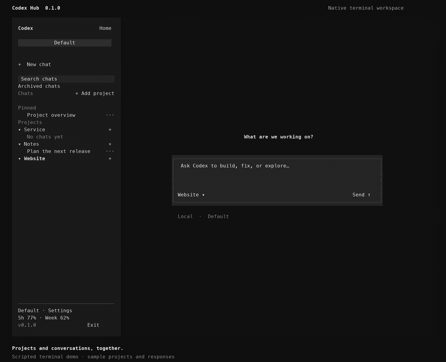

# Codex Hub

[](https://github.com/mhadifilms/codex-hub/actions/workflows/test.yml)
[](https://github.com/mhadifilms/codex-hub/releases/latest)
[](LICENSE)


**A terminal workspace that makes Codex feel at home.**

Organize projects and chats in a clickable sidebar, read native Markdown, steer running work, and return to your conversations after a restart. Powered by the official [Codex CLI](https://developers.openai.com/codex/cli/) and tmux.



## Unattended goals

`codex-hub control ACCOUNT THREAD command.json` submits a message to the chat's
owning frontend. The JSON has `text` and optionally `objective` to arm a native
Codex goal. Commands expire after two minutes and are skipped when a chat has
running work, approvals, queued messages, or an unsent draft. Results are stored
privately under the Hub configuration's `control/` directory. A claimed command
or uncertain dispatch requires manual inspection; it is never automatically replayed.

`codex-hub supervise plan.json` monitors selected goals without making model calls
on another account. Run it in a persistent terminal or tmux window. A plan contains
`hours` (default 12), `intervalSeconds` (default 3600), and a `tasks` array whose
entries have `account`, `thread`, and a continuation `prompt`. Only an active goal
observed idle on two checks can receive that prompt. Paused, blocked, completed,
or limited goals stay stopped. Drafts and queues are preserved. Closed chats stay
closed. Idle older frontends are reconnected before a later check can continue them.
The latest snapshot is `supervisor-status.json`; checks are retained in
`supervisor-events.jsonl`. The computer and tmux must remain running.

## Install

Requires Python **3.10+**, tmux **3.2+**, Codex CLI **0.159+**, and a terminal with mouse reporting and 256 colors.

### Homebrew · macOS and Linux

```sh
brew install mhadifilms/codex-hub/codex-hub
codex login
codex-hub
```

If Codex CLI is missing, use `brew install --cask codex` on macOS, or `npm install --global @openai/codex` on Linux (requires Node.js).

### From source · macOS and Linux

```sh
git clone https://github.com/mhadifilms/codex-hub.git
cd codex-hub
./install.sh --bootstrap
codex login
~/.local/bin/codex-hub
```

`--bootstrap` installs missing dependencies using Homebrew on macOS or apt/npm on Debian and Ubuntu. On other Linux distributions, install the requirements with your package manager and run `./install.sh`.

The installer creates a dedicated Python environment. Add `~/.local/bin` to your shell's PATH to use `codex-hub` directly. Use `--prefix /your/path` for a different install location, or `--no-deps` when the selected Python already has Rich and Pillow.

### Windows · Windows Terminal + WSL

Windows support runs inside WSL; tmux and curses require a Linux terminal environment.

1. In an administrator PowerShell, run `wsl --install`. Restart if requested, then open Ubuntu once to finish setup.
2. Clone or download this repository, then run PowerShell in its directory:

   ```powershell
   powershell -ExecutionPolicy Bypass -File .\install.ps1
   ```

3. Open **Ubuntu** in Windows Terminal:

   ```sh
   codex login
   ~/.local/bin/codex-hub
   ```

Use `-Distribution NAME` if your WSL distribution has another name. The installer supports Ubuntu/Debian dependency setup; `-NoBootstrap` uses existing dependencies. Clipboard copy and links use Windows applications when WSL interoperability is available. Store active projects in the Linux filesystem for better performance.

## The workspace

| Feature | How it works |
| --- | --- |
| Projects and chats | Click **Add project** to browse or create folders. Search chats, pin favorites, and keep recent work at the top. |
| Chat management | Right-click a chat or use **···** to rename, pin, close, archive, or delete it. **Archived chats** lets you restore conversations. Delete requires confirmation. |
| Drafts | Untouched empty chats stay out of history. Nonempty drafts appear as **Draft** and survive restarts while their tab is open. |
| Messages and queues | **Enter** sends, or queues while Codex is working. **Double Enter** dispatches the queue into the active turn. Each queued message has Steer, edit, and delete controls. |
| Multiline input | **Alt+Enter** or **↵** inserts a newline. Bracketed multiline paste stays in the draft until sent. Shift+Enter works when your terminal reports it distinctly. |
| Markdown | Styled paragraphs, headings, lists, tables, quotes, links, and highlighted code render directly in the terminal. |
| Scrolling | Wheel/trackpad input, a draggable scrollbar, Page Up/Down, and jump to latest. Reading position stays anchored during streaming and resizing. |
| Activity | Thinking and tool calls remain expandable after a turn finishes. User messages have distinct bubbles. |
| Models and permissions | Choose models and reasoning effort from the installed backend's catalog. The approval dropdown offers Ask approval, Approve for me, and Full access. Full access allows unrestricted file/network actions without approval prompts. |
| Context and usage | Hover the context percentage for context usage and compaction status. The sidebar shows verified session and weekly percentages remaining. |
| Selection | Click to position the composer caret; drag to select text. **Copy** copies selection or the latest response. The chat menu opens tmux text selection mode. |
| Images and links | **+** attaches local images. Preview opens the original image in the system viewer at full resolution. Click links to open them. |
| Persistence | Reopen the hub to restore open chats, drafts, model choices, and paused queues. Close stops a tab and keeps history; archive hides history until restored. |

### Shared chat library

Set `"sharedLibrary": true` in the configuration shown by `codex-hub config`, then run
`codex-hub setup --reload`. Every account's sidebar shows the same combined chats,
projects, pins, and archives. Opening a chat switches to its owning account;
renaming or archiving it updates the shared view. New chats use the selected account.

The library reads each account's live history rather than copying databases.
Sign-ins, model settings, drafts, and running chats remain with their owning account.
It does not synchronize with ChatGPT cloud history or let two accounts write the same
conversation. Set `"sharedLibrary": false` to return to separate sidebars.
| Exit | Click **Exit** to detach. Chats keep running in tmux until stopped or closed. |

Icons show labels on hover. **☰** collapses the sidebar for more room; the layout supports an 80-column terminal.

### Slash commands

`/model`, `/approvals` (`/permissions`), `/compact`, `/status`, `/new`, `/resume`, `/stop`, `/queue`, `/pin`, and `/help` run locally when you press Enter. Suggestions appear while typing `/`. Unsupported CLI commands report an explicit error; chat details offer **Open in Codex CLI** for CLI-specific workflows.

### Configuration

The default workspace uses your existing `~/.codex` home. Click **Settings** to adjust scrolling, rename a workspace, choose a default, or add another Codex home. Additional homes are optional and each has its own chat and project lists.

```sh
codex-hub config                         # config file location
codex-hub accounts add work --label Work
codex-hub accounts login work
codex-hub accounts edit work --default
codex-hub doctor                         # backend path, version, and diagnostics
```

Settings live under `$XDG_CONFIG_HOME/codex-hub` or `~/.config/codex-hub`. Existing installations reuse `~/.codex-subs`. Set `CODEX_HUB_ROOT` to choose another directory. `scrollLines` sets wheel sensitivity from 1–20 lines per event; Settings includes precise, normal, and fast presets.

Use `--home /path/to/codex-home` with `accounts add` to reuse another existing Codex home. Otherwise it creates an isolated home. Removing an account removes its configuration entry and retains its files. Projects are ordinary filesystem folders; separate Git worktrees help when simultaneous chats edit the same repository.

### Updates and uninstall

```sh
brew upgrade mhadifilms/codex-hub/codex-hub
brew uninstall codex-hub
```

For source installs, `git pull` and rerun the installer. `./uninstall.sh` removes the installed Hub launchers and libraries while retaining configuration, chats, and Codex CLI. Use the same `--prefix` as installation.

Existing chats keep their running frontend until reloaded. Stop active work, then use **··· → Reload chat** or `codex-hub reload ACCOUNT`. Drafts and saved history are retained; recovered queues pause for review. The sidebar marks older frontends with **Update this chat**.

## Terminal compatibility

tmux **3.4** can lose the first click when selecting immediately after a right click. Pause briefly before selecting, click again, or upgrade tmux (`brew upgrade tmux` with Homebrew). The regular **···** chat controls remain available. Linux CI exercises the slower click path on that version.

The terminal controls fonts and line spacing. Clipboard support uses `pbcopy`, Windows PowerShell under WSL, `wl-copy`, or `xclip`; tmux provides a copy buffer fallback. Image preview opens an external viewer. Desktop voice, embedded browser/editor panels, clipboard-image paste, and desktop-only plugins are not supported.

Codex Hub talks to the installed app-server through stdin/stdout. Models and protocol capabilities follow that CLI and the signed-in account. Run `codex-hub doctor` to diagnose an unexpected catalog or connection failure. Set `codexBinary` in config, or `CODEX_HUB_CODEX`, to select another executable.

If a chat stays on **Connecting**, check `doctor` and `codex login status`, then use Retry. Hub recovers an unsent draft when the backend no longer has its empty thread; missing conversations with sent messages are reported instead of replaced.

## Contributing

See [CONTRIBUTING](CONTRIBUTING.md), [CHANGELOG](CHANGELOG.md), and [security reporting](SECURITY.md). Issues and pull requests are welcome.

Independent open-source client for OpenAI Codex. [MIT licensed](LICENSE).
